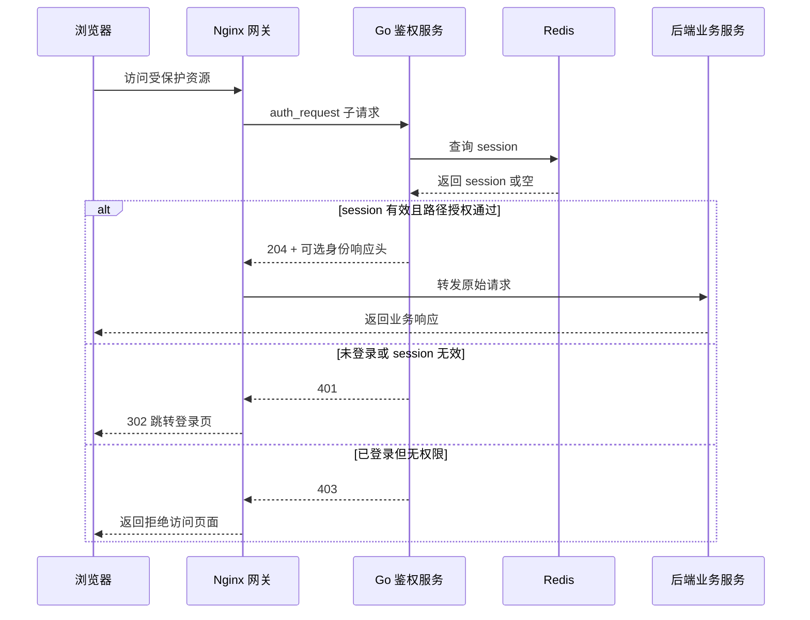

# Go 鉴权服务功能设计

## 1. 目标

设计并实现一个 Go 编写的独立鉴权服务，用于对接 Nginx 网关的 `auth_request` 模块。

核心目标：

- 通过 Nginx `auth_request` 统一保护后端业务服务。
- 提供浏览器登录页和登录提交能力。
- 登录成功后生成 session，并将 session 存储到 Redis。
- 浏览器通过 Cookie 携带 session。
- 鉴权服务负责登录态校验和路径授权，后端业务服务对鉴权无感。
- 项目结构遵循 Kratos framework layout。

## 2. 已确认需求

已确认：

- 网关使用标准 Nginx `auth_request` 模块。
- 登录用户来源为 YAML 配置文件。
- 第一版只支持浏览器 Cookie session，不支持 API token。
- session 和 Cookie 每个域名独立管理，不做跨域名共享登录态。
- 生产部署环境为 HTTPS，生产环境 Cookie 默认启用 `Secure`。
- session 默认空闲超时时间为 `30m`。
- session 绝对最长有效期为 `24h`。
- session 支持滑动过期，按空闲 N 分钟表达。
- 允许同一账号多设备同时登录。
- 后端业务服务对鉴权无感，不要求业务服务参与登录态校验。
- 鉴权服务支持访问路径限制，路径限制放入 M1。
- 路径授权采用白名单逻辑，只有命中允许规则才放行。
- 路径匹配支持前缀匹配和 Nginx 风格通配符匹配。
- 登录失败达到 3 次后，封禁来源 IP 和用户名 30 分钟。
- 支持配置登录用户白名单。
- 用户白名单默认开启，并在 YAML 中显式配置。
- 非白名单用户尝试登录时，直接封禁来源 IP。
- 登录失败审计写入独立文件日志，按天切分，默认永久保存。
- 登录失败审计记录失败用户名和密码尝试指纹，不记录明文密码。
- 登录页使用服务端 HTML 模板。
- 一期不提供 Dockerfile。
- 一期不提供 docker-compose。
- 一期不提供密码哈希生成命令。

## 3. 关键设计约定

### 3.1 Nginx 跳转约定

标准 `auth_request` 子请求不建议直接返回 `302`。

约定：

- `/auth/verify` 未登录时返回 `401 Unauthorized`。
- `/auth/verify` 已登录但无权限时返回 `403 Forbidden`。
- Nginx 使用 `error_page 401 =302 /login?redirect=$request_uri` 将未登录请求跳转到登录页。
- 登录接口和登出接口可以直接返回 `302`。

### 3.2 后端无感

后端业务服务不参与登录态校验，不要求后端理解 session。

鉴权服务可以可选返回用户身份响应头，例如 `X-Auth-User`、`X-Auth-User-ID`、`X-Auth-Groups`，但默认后端不依赖这些响应头。

### 3.3 密码尝试记录约定

登录失败审计需要记录失败用户名和密码尝试信息，但不记录明文尝试密码。

原因：

- 明文记录尝试密码会让日志、备份、运维链路变成密码泄露源。
- 即使失败密码不是正确密码，也可能是用户在其他系统使用的真实密码。

替代方案：

- 记录 `HMAC-SHA256(password_attempt, audit_secret)` 形式的密码尝试指纹。
- 指纹只能用于判断多次失败是否来自同一个尝试密码，不能还原密码原文。

## 4. 总体架构



## 5. 核心流程

### 5.1 未登录访问受保护资源

1. 用户访问 `https://example.com/private/page`。
2. Nginx 对受保护 location 发起内部鉴权子请求，例如 `GET /_auth/verify`。
3. 鉴权服务检查 Cookie 中的 session。
4. 如果 Cookie 不存在、session 不存在、session 过期或 session 已撤销，返回 `401 Unauthorized`。
5. Nginx 将 `401` 转换为登录页跳转，例如 `/login?redirect=/private/page`。

### 5.2 登录成功

1. 用户打开登录页。
2. 用户提交用户名、密码和可选的 redirect 参数。
3. 鉴权服务先检查 IP 封禁、用户名封禁和用户白名单。
4. 鉴权服务校验用户名和密码。
5. 校验通过后生成高熵 session id。
6. 鉴权服务将 session 写入 Redis，并设置 TTL。
7. 鉴权服务通过 `Set-Cookie` 写入 session Cookie。
8. 鉴权服务将用户重定向回原始 redirect 地址。

### 5.3 已登录访问受保护资源

1. 用户访问受保护资源并自动携带 session Cookie。
2. Nginx 发起 `auth_request` 子请求。
3. 鉴权服务读取 Cookie 并查询 Redis。
4. session 有效后，鉴权服务根据 `Host`、`X-Original-URI`、`X-Original-Method` 等信息匹配路径授权规则。
5. session 有效且路径规则允许时返回 `204 No Content`。
6. 已登录但路径规则不允许时返回 `403 Forbidden`。
7. 如果开启滑动过期，鉴权成功时刷新 Redis TTL。

### 5.4 登录失败

1. 用户提交登录请求。
2. 鉴权服务检查来源 IP 是否已封禁。
3. 鉴权服务检查用户名是否已封禁。
4. 如果用户名不在 YAML 白名单中，直接封禁来源 IP 30 分钟。
5. 如果密码校验失败，按 IP 和用户名两个维度累计失败次数。
6. 任一维度失败达到 3 次后，封禁对应 IP 和用户名 30 分钟。
7. 登录失败写入按天切分的审计文件。
8. 对外统一返回登录失败，不暴露用户不存在、密码错误、被封禁、非白名单等具体原因。

### 5.5 登出

1. 用户访问登出接口。
2. 鉴权服务根据 Cookie 定位 session。
3. 鉴权服务删除 Redis 中的 session。
4. 鉴权服务清理浏览器 Cookie。
5. 鉴权服务跳转到登录页或指定地址。

## 6. HTTP 接口设计

### 6.1 登录页

```http
GET /login?redirect=/private/page
```

用途：

- 使用服务端 HTML 模板渲染登录页面。
- 保留登录成功后的跳转目标。
- 模板路径通过 YAML 配置。

响应：

- `200 OK`
- `Content-Type: text/html`

### 6.2 登录提交

```http
POST /login
Content-Type: application/x-www-form-urlencoded

username=alice&password=secret&redirect=/private/page
```

用途：

- 校验用户白名单。
- 校验 IP 和用户名封禁状态。
- 校验用户名和密码。
- 登录成功后创建 session。
- 设置 Cookie 并跳转。

成功响应：

```http
302 Found
Set-Cookie: auth_session=...; HttpOnly; Secure; SameSite=Lax; Path=/
Location: <redirect>
```

失败响应：

```http
401 Unauthorized
```

### 6.3 Nginx 鉴权校验

```http
GET /auth/verify
Cookie: auth_session=<session-id>
X-Original-Host: app.example.com
X-Original-URI: /admin/page?x=1
X-Original-Method: GET
```

用途：

- 专供 Nginx `auth_request` 子请求调用。
- 校验 session。
- 执行路径白名单授权。
- 不直接返回登录页跳转。

成功响应：

```http
204 No Content
X-Auth-User: alice
X-Auth-User-ID: user-001
X-Auth-Groups: admin,dev
```

失败响应：

```http
401 Unauthorized
```

禁止访问响应：

```http
403 Forbidden
```

状态码约定：

- `401 Unauthorized`：未登录、session 缺失、session 过期或 session 无效。
- `403 Forbidden`：已登录，但当前用户无权访问目标域名、路径或方法。
- `204 No Content`：已登录且授权通过。

### 6.4 当前用户信息

```http
GET /me
Cookie: auth_session=<session-id>
```

用途：

- 给登录页或管理页面查询当前登录状态。
- 可选接口，初版可以保留但不一定立即实现。

成功响应示例：

```json
{
  "user_id": "user-001",
  "username": "alice",
  "display_name": "Alice",
  "groups": ["admin", "dev"],
  "expires_at": "2026-04-17T12:00:00Z"
}
```

### 6.5 登出

```http
POST /logout
Cookie: auth_session=<session-id>
```

用途：

- 删除服务端 session。
- 清理客户端 Cookie。

成功响应：

```http
302 Found
Set-Cookie: auth_session=; Max-Age=0; HttpOnly; Secure; SameSite=Lax; Path=/
Location: /login
```

## 7. Redis session 设计

### 7.1 Key 设计

```text
auth:session:<host-hash>:<session-id>
```

说明：

- `host-hash` 由当前访问域名归一化后计算得到。
- 每个域名的 session 独立管理。
- 同一个浏览器访问不同域名时，即使 Cookie 名相同，也对应不同 Redis session 命名空间。

### 7.2 Value 设计

初版建议使用 JSON，便于调试和演进。

```json
{
  "session_id_hash": "sha256(session-id)",
  "user_id": "user-001",
  "username": "alice",
  "display_name": "Alice",
  "groups": ["admin", "dev"],
  "host": "app.example.com",
  "created_at": "2026-04-17T10:00:00Z",
  "last_seen_at": "2026-04-17T10:15:00Z",
  "expires_at": "2026-04-18T10:00:00Z",
  "client_ip": "203.0.113.10",
  "user_agent": "Mozilla/5.0 ..."
}
```

### 7.3 TTL 策略

已确认策略：

- session 超时时间通过配置控制。
- 默认空闲超时时间为 `30m`。
- 默认绝对最长有效期为 `24h`。
- 支持滑动过期，用空闲超时时间表示。
- 鉴权请求命中 session 时，如果开启滑动过期，则刷新 Redis TTL。
- 即使持续活跃，达到绝对最长有效期后也必须重新登录。
- Redis TTL 刷新时取 `idle_timeout` 和剩余绝对有效期的较小值，避免滑动过期突破 `24h` 上限。
- 默认允许单用户多设备同时登录。
- 默认不限制同一用户最大 session 数。

## 8. Cookie 设计

建议默认配置：

```text
Name: auth_session
Path: /
Domain: 不设置
HttpOnly: true
Secure: true
SameSite: Lax
Max-Age: 与 session TTL 对齐
```

说明：

- 生产环境必须启用 `Secure`，要求 HTTPS。
- 默认不设置 Cookie `Domain` 属性，让浏览器按当前域名保存 Cookie。
- session id 应为高熵随机值，不直接包含用户信息。
- 服务端日志不能打印完整 session id。

## 9. Nginx 对接建议

关键约定：

- `/auth/verify` 是 `auth_request` 子请求接口。
- 未登录返回 `401`。
- 无权限返回 `403`。
- 登录页跳转由 Nginx 将 `401` 转换为 `302` 完成。
- 路径授权所需原始请求信息通过 `X-Original-URI`、`X-Original-Method`、`X-Original-Host` 传给鉴权服务。

示例配置：

```nginx
location /private/ {
    auth_request /_auth/verify;

    # 可选：如果后端需要用户信息，可以打开这些头的转发；默认后端对鉴权无感。
    auth_request_set $auth_user $upstream_http_x_auth_user;
    auth_request_set $auth_user_id $upstream_http_x_auth_user_id;
    auth_request_set $auth_groups $upstream_http_x_auth_groups;

    proxy_set_header X-Auth-User $auth_user;
    proxy_set_header X-Auth-User-ID $auth_user_id;
    proxy_set_header X-Auth-Groups $auth_groups;

    error_page 401 =302 /login?redirect=$request_uri;
    error_page 403 = /403.html;

    proxy_pass http://backend;
}

location = /_auth/verify {
    internal;
    proxy_pass http://auth-service/auth/verify;
    proxy_pass_request_body off;
    proxy_set_header Content-Length "";
    proxy_set_header X-Original-URI $request_uri;
    proxy_set_header X-Original-Method $request_method;
    proxy_set_header X-Original-Host $host;
    proxy_set_header X-Real-IP $remote_addr;
    proxy_set_header X-Forwarded-For $proxy_add_x_forwarded_for;
    proxy_set_header X-Forwarded-Host $host;
    proxy_set_header X-Forwarded-Proto $scheme;
}

location /login {
    proxy_pass http://auth-service;
}

location /logout {
    proxy_pass http://auth-service;
}
```

## 10. 用户凭据来源

初版用户来源：

- YAML 配置文件内置用户。
- 密码使用 bcrypt 或 argon2id 哈希存储。
- 用户配置中包含用户 ID、用户名、展示名和用户组。
- 用户组用于路径访问限制。

后续可扩展用户来源：

- 数据库存储用户。
- LDAP/AD。
- OIDC/OAuth2。

设计建议：

- 第一版采用配置文件用户和 bcrypt 密码哈希。
- 通过接口抽象 `UserProvider`，后续可以替换为数据库、LDAP 或 OIDC。
- 一期不提供密码哈希生成命令，密码哈希由外部方式生成后写入 YAML。

## 11. 访问路径限制设计

鉴权服务支持对访问路径做限制，该能力在 `/auth/verify` 中完成，后端业务服务无需感知。

### 11.1 授权判断输入

Nginx 调用 `/auth/verify` 时传递：

- `Host` 或 `X-Original-Host`：当前访问域名。
- `X-Original-URI`：原始请求 URI，包含 path 和 query。
- `X-Original-Method`：原始 HTTP 方法。
- Cookie 中的 session id。

鉴权服务从 session 中读取：

- 用户 ID。
- 用户名。
- 用户组。

### 11.2 授权判断结果

- 未登录、session 失效或 Cookie 无效：返回 `401 Unauthorized`。
- 已登录但无权访问：返回 `403 Forbidden`。
- 已登录且规则允许访问：返回 `204 No Content`。

### 11.3 规则匹配方式

M1 支持：

- 按域名匹配。
- 按路径前缀匹配。
- 按 Nginx 风格通配符匹配。
- 按 HTTP 方法匹配。
- 按用户组匹配。
- 按用户名或用户 ID 匹配。

Nginx 风格路径匹配约定：

- `path_match: "prefix"` 对齐 Nginx 普通前缀 `location /prefix/` 语义。
- `path_match: "wildcard"` 采用 Nginx 正则 `location ~ pattern` 风格，不采用 shell glob。
- 通配符场景用正则表达式表达，例如 `~ ^/ops/[^/]+/dashboard$`。
- M1 先支持大小写敏感正则 `~`。
- 大小写不敏感正则 `~*` 可后续扩展。
- 匹配时先对 URI path 做归一化，不使用 query string。
- 路径匹配默认大小写敏感。

### 11.4 白名单逻辑

规则按配置顺序从上到下匹配：

1. 第一条匹配到域名、路径和方法的允许规则生效。
2. 如果规则要求用户组，则当前用户必须属于至少一个允许的用户组。
3. 如果规则要求用户 ID 或用户名，则当前用户必须在允许列表内。
4. 未匹配任何允许规则时，返回 `403 Forbidden`。

白名单约定：

- `authorization.enabled=false` 时，只校验登录态，不做路径授权。
- `authorization.enabled=true` 时，只允许命中白名单规则的请求访问。
- 启用路径授权但没有配置任何规则时，所有受保护路径都会返回 `403 Forbidden`。
- 规则中不配置显式 `deny`，避免 allow 和 deny 优先级引入歧义。

### 11.5 授权配置示例

```yaml
authorization:
  enabled: true
  mode: "whitelist"
  rules:
    - name: "admin-only"
      hosts: ["admin.example.com"]
      path_match: "prefix"
      paths: ["/admin/"]
      methods: ["GET", "POST", "PUT", "DELETE"]
      allow_groups: ["admin"]

    - name: "readonly-users"
      hosts: ["app.example.com"]
      path_match: "prefix"
      paths: ["/reports/"]
      methods: ["GET"]
      allow_groups: ["admin", "report-viewer"]

    - name: "ops-wildcard"
      hosts: ["app.example.com"]
      path_match: "wildcard"
      paths: ["~ ^/ops/[^/]+/dashboard$", "~ ^/ops/reports/.*\\.html$"]
      methods: ["GET"]
      allow_users: ["alice"]
```

## 12. 登录失败防护与审计

### 12.1 登录失败策略

已确认策略：

- 按用户名和 IP 两个维度统计登录失败次数。
- 登录失败达到 3 次后，同时封禁来源 IP 和用户名 30 分钟。
- 支持配置登录用户白名单，默认开启。
- 白名单在 YAML 中显式配置，不自动复用 `users` 列表。
- 如果提交的用户名不在白名单内，直接封禁来源 IP 30 分钟。
- 被封禁 IP 或被封禁用户名再次登录时，不进行密码校验，直接返回统一登录失败响应。
- 对外响应不区分用户不存在、密码错误、用户被封禁、IP 被封禁、非白名单用户。

### 12.2 Redis key

建议 Redis key：

```text
auth:login:fail:ip:<ip-hash>
auth:login:fail:user:<username-hash>
auth:login:ban:ip:<ip-hash>
auth:login:ban:user:<username-hash>
```

说明：

- 失败计数 key 的 TTL 与封禁观察窗口一致，默认 `30m`。
- ban key 的 TTL 为封禁时长，默认 `30m`。
- IP 和用户名建议哈希后入 key，避免 Redis key 直接暴露敏感信息。

### 12.3 登录失败审计

登录失败事件写入独立安全审计文件日志。

记录字段：

- 时间。
- 来源 IP。
- 用户名。
- User-Agent。
- 失败原因。
- 封禁结果。
- 密码尝试 HMAC 指纹。

文件策略：

- 使用 JSON Lines 格式。
- 按天切分。
- 文件名示例：`logs/login_failure_audit-2026-04-17.jsonl`。
- 默认永久保存。
- 服务只负责按日期写入对应文件，不负责压缩和删除。
- 审计日志文件权限建议为 `0600`。
- 审计日志目录权限建议为 `0700`。

## 13. 安全设计

### 13.1 密码安全

- 不存储明文密码。
- 使用 bcrypt 或 argon2id 存储密码哈希。
- 登录失败时不要暴露“用户不存在”或“密码错误”的具体差异。

### 13.2 session 安全

- session id 使用加密安全随机数生成。
- Redis 中可以存储 session id 的哈希，避免泄露后被直接利用。
- 登出时必须删除服务端 session。
- Cookie 必须设置 `HttpOnly`。
- 生产环境 Cookie 必须设置 `Secure`。
- 服务端日志不能打印完整 session id。

### 13.3 redirect 防护

- `redirect` 参数必须校验，避免开放重定向漏洞。
- 初版只允许相对路径，例如 `/private/page`。
- 不允许 `http://evil.example`、`//evil.example` 等外部地址。

## 14. YAML 配置设计

配置文件格式确定为 YAML。

建议初版配置：

```yaml
server:
  listen: ":8080"
  public_base_url: "https://example.com"
  trust_proxy_headers: true

templates:
  login_page: "templates/login.html"

redis:
  addr: "127.0.0.1:6379"
  username: ""
  password: ""
  db: 0
  key_prefix: "auth"

session:
  cookie_name: "auth_session"
  cookie_domain: ""
  idle_timeout: "1800s"
  absolute_timeout: "86400s"
  sliding_expiration: true
  secure_cookie: true
  same_site: "Lax"
  per_host_namespace: true

users:
  - id: "user-001"
    username: "alice"
    display_name: "Alice"
    password_hash: "$2a$..."
    groups: ["admin", "dev"]

authorization:
  enabled: true
  mode: "whitelist"
  rules:
    - name: "admin-only"
      hosts: ["admin.example.com"]
      path_match: "prefix"
      paths: ["/admin/"]
      methods: ["GET", "POST", "PUT", "DELETE"]
      allow_groups: ["admin"]

    - name: "ops-wildcard"
      hosts: ["app.example.com"]
      path_match: "wildcard"
      paths: ["~ ^/ops/[^/]+/dashboard$", "~ ^/ops/reports/.*\\.html$"]
      methods: ["GET"]
      allow_users: ["alice"]

security:
  login_failure:
    max_attempts: 3
    window: "1800s"
    ban_duration: "1800s"
    ban_ip: true
    ban_user: true
    user_whitelist_enabled: true
    user_whitelist: ["alice", "bob"]
    ban_ip_on_non_whitelisted_user: true
    password_attempt_audit: "hmac"
    password_attempt_hmac_secret: "${AUTH_PASSWORD_AUDIT_SECRET}"
  allow_redirect_hosts: []

logging:
  level: "info"
  audit:
    login_failure_dir: "logs"
    login_failure_file_pattern: "login_failure_audit-2006-01-02.jsonl"
    login_failure_rotate: "daily"
    login_failure_retention: "forever"
    file_mode: "0600"
    dir_mode: "0700"
```

配置说明：

- `templates.login_page` 指向服务端 HTML 登录页模板。
- Kratos protobuf Duration 配置使用 `1800s`、`86400s` 这类 protobuf duration 写法；语义上分别对应 30 分钟和 24 小时。
- `session.cookie_domain` 为空表示不设置 Cookie `Domain`，让 Cookie 按当前域名独立保存。
- `session.per_host_namespace` 为 `true` 时，Redis session key 会包含访问域名命名空间。
- `authorization.mode=whitelist` 表示只放行命中允许规则的请求，未命中时返回 `403`。
- `security.login_failure.password_attempt_audit` 不支持记录明文密码，建议只使用 `hmac` 或 `none`。
- `security.login_failure.user_whitelist_enabled` 默认开启，白名单由 `user_whitelist` 显式配置。
- `logging.audit.login_failure_file_pattern` 使用 Go 日期布局，按天生成独立登录失败审计日志文件。
- `logging.audit.login_failure_rotate=daily` 表示服务只做按天切分，不做压缩和删除。
- `logging.audit.login_failure_retention=forever` 表示服务不自动删除登录失败审计日志。

## 15. 项目结构设计

项目结构遵循 Kratos layout。

参考资料：

- [Kratos Layout](https://go-kratos.dev/en/docs/intro/layout)
- [Kratos Configuration](https://go-kratos.dev/docs/component/config/)

建议一期目录结构：

```text
.
├── api
│   └── auth
│       └── v1
├── cmd
│   └── server
│       ├── main.go
│       ├── wire.go
│       └── wire_gen.go
├── configs
│   └── config.yaml
├── internal
│   ├── biz
│   │   ├── auth.go
│   │   ├── session.go
│   │   ├── authorization.go
│   │   └── login_failure.go
│   ├── conf
│   │   ├── conf.proto
│   │   └── conf.pb.go
│   ├── data
│   │   ├── data.go
│   │   ├── redis_session.go
│   │   ├── redis_login_failure.go
│   │   ├── file_audit.go
│   │   └── user_config.go
│   ├── server
│   │   ├── http.go
│   │   └── server.go
│   └── service
│       ├── auth_service.go
│       ├── login_handler.go
│       └── verify_handler.go
├── templates
│   └── login.html
└── deploy
    └── nginx
        └── auth_request.conf
```

分层说明：

- `cmd/server`：Kratos 服务启动入口和依赖注入。
- `configs/config.yaml`：本地开发样例 YAML 配置，生产环境建议挂载外部配置。
- `internal/conf`：配置结构定义，遵循 Kratos 使用 proto 定义配置结构的方式。
- `internal/biz`：认证、session、路径授权、登录失败封禁等核心业务规则。
- `internal/data`：Redis session、Redis 封禁计数、YAML 用户加载、按天文件审计日志等数据访问实现。
- `internal/service`：登录页、登录提交、登出、`/auth/verify` 等 HTTP handler 的编排层。
- `internal/server`：Kratos HTTP server 初始化和路由注册。
- `templates`：服务端 HTML 模板。
- `deploy/nginx`：Nginx `auth_request` 示例配置。

一期暂不提供：

- Dockerfile。
- docker-compose。
- `authctl hash-password` 或其他密码哈希生成命令。

## 16. 可观测性

建议提供：

- 结构化日志。
- 请求 ID 透传。
- 登录成功、登录失败、登出、session 失效等安全事件日志。
- 登录失败审计写入单独文件，采用 JSON Lines 追加写入。
- 登录失败审计日志按天切分，示例文件名为 `logs/login_failure_audit-2026-04-17.jsonl`。
- 登录失败审计日志永久保存，服务不自动删除历史文件。
- Prometheus 指标可后续实现。
- 健康检查接口 `GET /healthz`。
- 就绪检查接口 `GET /readyz`，用于检查 Redis 是否可用。

## 17. 初版里程碑

### M1：最小可用认证闭环

- Kratos layout 项目结构。
- Go HTTP 服务。
- YAML 配置文件加载。
- 服务端 HTML 模板登录页和登录提交。
- bcrypt 密码校验。
- 登录失败 3 次封禁 IP 和用户名 30 分钟。
- YAML 配置登录用户白名单，默认开启，非白名单用户尝试登录时直接封禁来源 IP。
- 登录失败安全审计按天写入独立文件日志并永久保存。
- Redis session 创建和校验。
- session 可配置超时和滑动过期。
- `/auth/verify` 对接 Nginx。
- 基于配置的轻量路径访问限制，采用白名单逻辑，支持前缀匹配和 Nginx 风格通配符匹配。
- `/logout` 登出。
- 基础 Nginx 配置示例。

### M2：安全增强

- 验证码或二次验证。
- redirect 白名单或相对路径校验增强。
- session id 脱敏日志。
- 更完整的路径授权测试。

### M3：运维增强

- Prometheus 指标。
- 可选 Dockerfile 和 compose 示例。
- 配置热加载或优雅重启。
- 更完整的集成测试。

### M4：身份源扩展

- 数据库用户源。
- LDAP/AD 用户源。
- OIDC/OAuth2 登录。
- 用户组和角色映射。

## 18. 对话确认记录摘要

第一轮确认：

1. Nginx 网关使用标准 `auth_request`。
2. 登录用户来源为配置文件。
3. session 和 Cookie 每个域名独立管理。
4. session 有效期可配置。
5. 允许同一账号多设备同时登录。
6. 后端业务服务对鉴权无感。
7. 部署环境为 HTTPS。
8. 鉴权服务需要支持访问路径限制。

第二轮确认：

1. `/auth/verify` 未登录返回 `401`，由 Nginx 转 `302` 到登录页。
2. 路径访问限制放入 M1。
3. 授权规则采用白名单逻辑。
4. 路径匹配 M1 支持前缀匹配和通配符匹配。
5. session 支持配置超时。
6. session 支持滑动过期。
7. 第一版只支持浏览器 Cookie session，不支持 API token。

第三轮确认：

1. 通配符匹配按照 Nginx 风格规则，不采用 shell glob 语义。
2. session 默认空闲超时时间为 `30m`。
3. session 绝对最长有效期为 `24h`。
4. 登录失败达到 3 次后，封禁来源 IP 和用户名 30 分钟。
5. 支持配置登录用户白名单。
6. 非白名单用户尝试登录时，直接封禁来源 IP。
7. 登录失败审计需要记录失败用户名。
8. 登录失败审计不记录明文尝试密码，只记录不可逆密码尝试指纹。

第四轮确认：

1. 配置文件格式使用 YAML。
2. 登录页使用服务端 HTML 模板。
3. 登录失败日志永久保存。
4. 登录失败日志写入单独文件日志。
5. 用户白名单默认开启。
6. 用户白名单在 YAML 中配置。

第五轮确认：

1. 项目结构按照 Kratos 框架指南和 kratos-layout 分层。
2. 一期不提供 Dockerfile。
3. 一期不提供 docker-compose。
4. 一期不提供密码哈希生成命令。
5. 登录失败审计文件按天切分。
6. 审计文件切分实现从简，服务只负责按日期写入对应文件，不负责压缩和删除。

## 19. 待确认问题

进入实现前建议继续确认：

1. Go module 名称使用什么，例如 `simple_auth` 还是 `github.com/<org>/simple_auth`。
2. HTTP 服务默认监听地址是否使用 `:8080`。
3. Redis 一期是否只支持单机地址，还是需要支持 Sentinel 或 Cluster。
4. 配置文件路径是否默认使用 `configs/config.yaml`，并允许通过启动参数覆盖。
5. bcrypt 和 argon2id 中初版选择哪一个，当前建议优先使用 bcrypt 简化实现。
